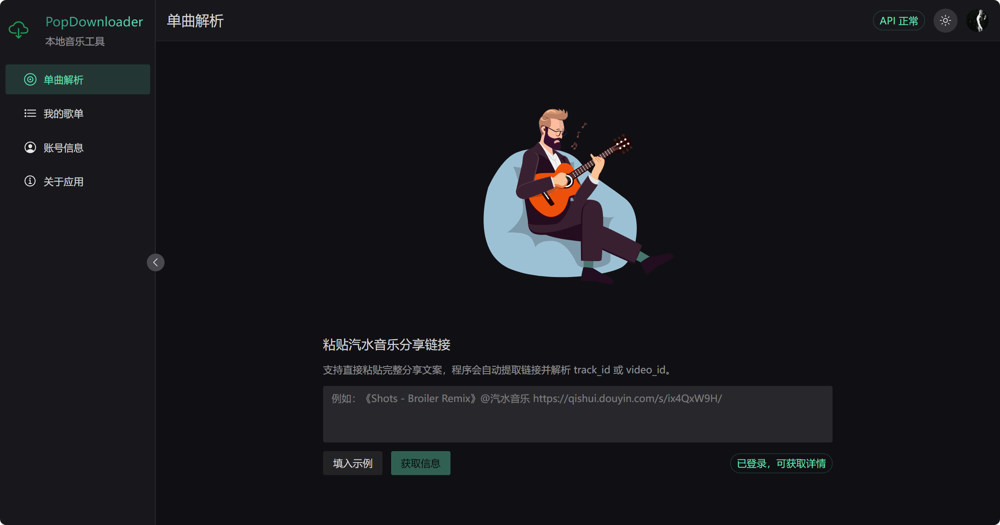
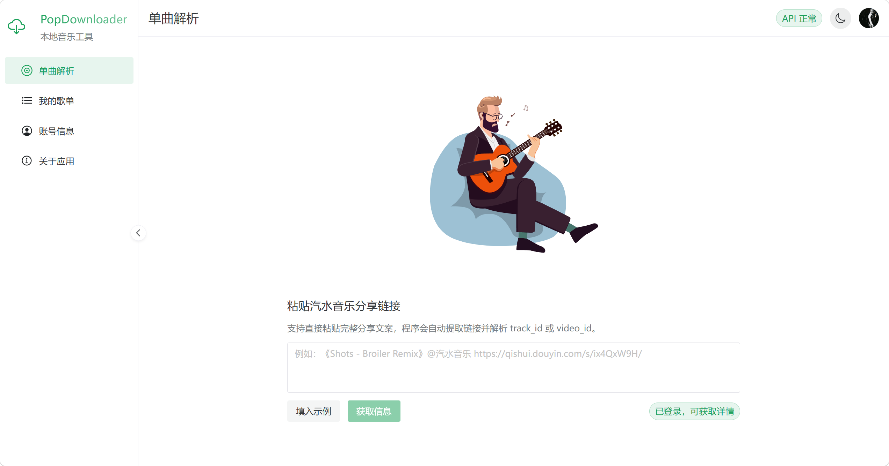
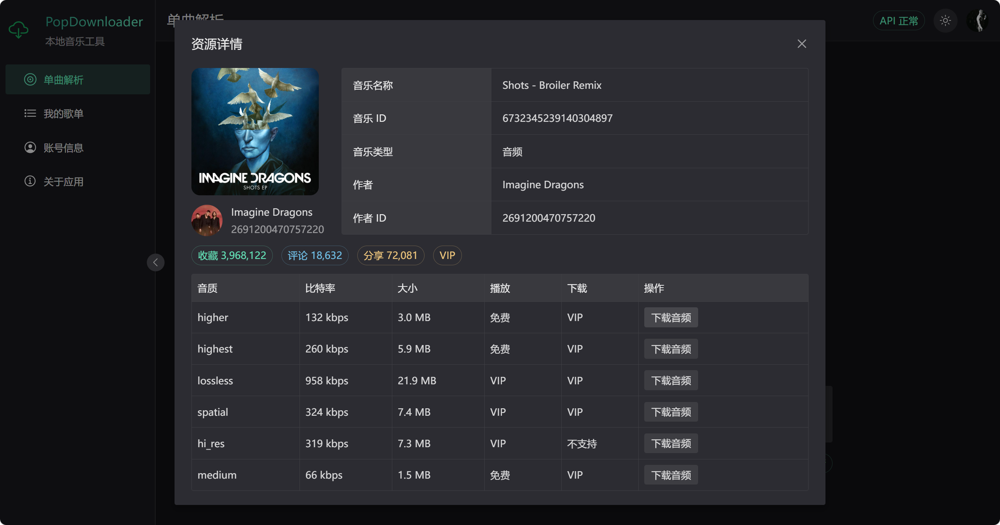
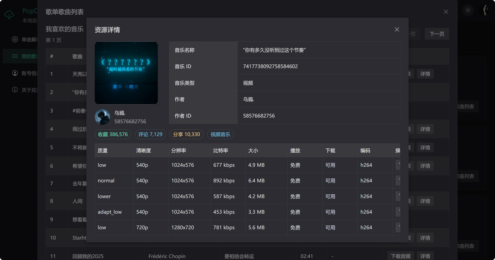
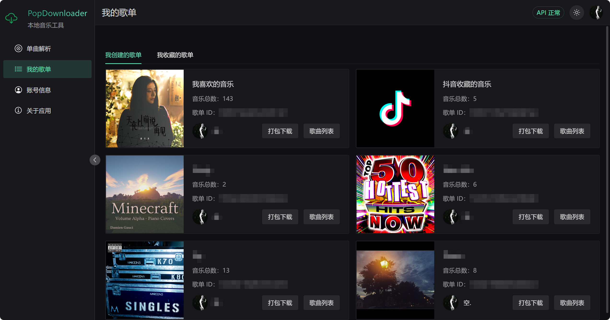
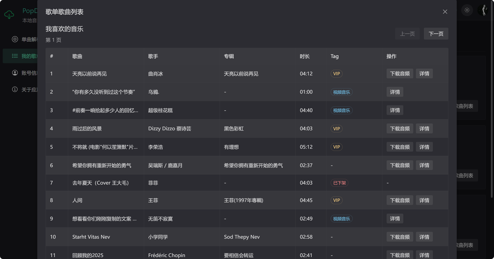
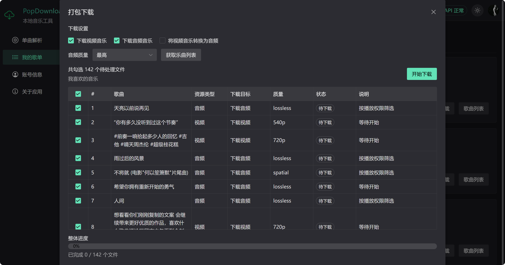
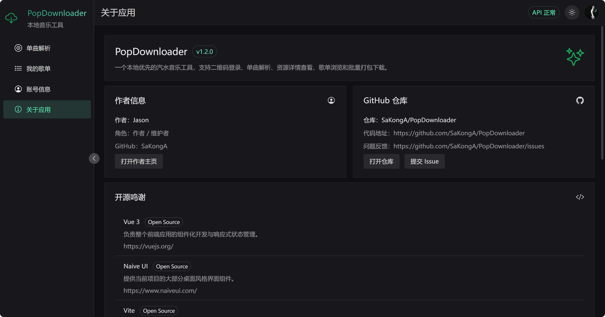

# PopDownloader 🎵

一个本地优先的汽水音乐工具，基于 Vue 3、Naive UI、Vite 和 Express 构建。  
它把登录、解析、查看详情、单曲下载、歌单浏览和批量打包下载这些常用能力整合到了一个本地应用里。

## 🖼️ 界面预览

### 单曲解析



### 单曲解析（浅色）



### 资源详情 - 音乐



### 视频详情



### 我的歌单



### 歌曲列表



### 打包下载



### 关于应用



## 🚀 当前功能

### 1. 二维码登录

- 支持获取登录二维码
- 支持轮询扫码状态
- 支持确认登录后获取 `sessionid`
- 支持登录后自动拉取当前账号信息
- 支持退出登录并清空本地登录状态

### 2. 单曲解析

- 支持直接粘贴汽水音乐分享文案
- 支持从分享文案中自动提取链接
- 支持请求分享页 HTML 并解析 `track_id` / `video_id`
- 支持单曲详情弹窗展示
- 支持区分音频资源和视频资源
- 支持展示对应资源的可用质量信息

### 3. 音频资源详情

- 支持展示歌曲名称、歌曲 ID、作者信息
- 支持展示收藏数、评论数、分享数
- 支持展示音质、比特率、大小、播放权限、下载权限
- 支持根据账号权限判断可不可下载
- 支持下载音频加密文件
- 支持写入 FLAC 元数据与封面

### 4. 视频资源详情

- 支持展示视频资源基础信息
- 支持展示质量、清晰度、分辨率、比特率、大小、编码
- 支持下载视频文件
- 支持提取视频中的音频并下载

### 5. 我的歌单

- 支持查看“我创建的歌单”
- 支持查看“我收藏的歌单”
- 支持展示歌单封面、标题、曲目数量、拥有者信息

### 6. 歌单详情

- 支持查看歌单内的资源列表
- 支持从歌单中查看音频 / 视频资源详情
- 支持复用统一的资源详情弹窗

### 7. 批量打包下载 📦

- 支持对歌单资源生成批量下载任务
- 支持勾选要处理的任务
- 支持下载音频音乐
- 支持下载视频音乐
- 支持将视频音乐转换为音频
- 支持按偏好选择音频质量（最高 / 最低）
- 支持把多个文件打包成 ZIP 下载
- 支持按“已完成文件数”显示实时整体进度
- 支持在任务表里展示每个任务的状态与说明

### 8. 账号信息页

- 支持展示当前登录账号信息
- 支持显示昵称、ID、头像、会员状态等内容

### 9. 界面与交互

- 支持浅色 / 深色主题切换
- 支持侧边栏页面导航
- 支持首页动画展示
- 支持桌面风格的管理型界面布局

## 🧱 技术栈

- Vue 3
- Naive UI
- Vite
- Express
- Archiver
- fluent-ffmpeg
- ffmpeg-installer
- flac-tagger
- lottie-web
- @vicons/ionicons5

## 🛠️ 运行环境

- Node.js 18 及以上
- npm 9 及以上

## 📥 安装依赖

```bash
npm install
```

## 💻 开发运行

同时启动前端和本地服务：

```bash
npm run dev
```

默认会启动：

- Vite 前端开发服务
- Express 本地接口服务

## 🏗️ 生产构建

```bash
npm run build
```

## ▶️ 本地启动

构建完成后可直接运行：

```bash
npm run start
```

## 📁 项目结构

```text
PopMusic/
├─ README-assets/           README 截图
├─ src/                     前端页面、组件与 API 封装
│  ├─ pages/                页面
│  ├─ components/           组件
│  ├─ api/                  前端接口请求
│  ├─ assets/               前端静态资源
│  └─ utils/                前端工具函数
├─ server/                  本地 Express API 与下载逻辑
│  ├─ apis/                 接口定义
│  ├─ config/               配置
│  └─ utils/                下载、解析、解密等工具
├─ index.html               前端入口 HTML
├─ vite.config.mjs          Vite 配置
└─ package.json             项目依赖与脚本
```

## 🔐 关于登录

- 当前项目通过二维码登录流程获取登录态，暂时不太稳定，可以使用aid参数登录
- 登录状态依赖本地保存的 `sessionid`，不会上传云端

## 🙏 特别感谢

本项目在解密与相关实现思路上，参考了以下开源项目，特此感谢：

- SodaDownloader  
  https://github.com/baizeyv/SodaDownloader
- music-lib  
  https://github.com/guohuiyuan/music-lib
- qishui-decrypt  
  https://github.com/naiyQAQ/qishui-decrypt

## ⛔️ 免责声明

- PopDownloader 仅作为学习交流使用，不涉及任何破解、绕过会员限制获取音频的功能，如有侵权，请联系作者删除！
